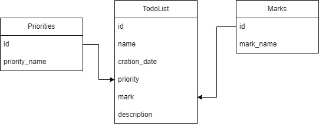

В проекте используется:
1. Бэкенд на NestJS
2. Фронтенд на NextJS с SSR на typescript.
3. NoSQL база данных mongoDB (удалённая, поэтому необходимо подключение к сети)

Схема базы данных:



Функции:
1. Фильтрация: по дате(старые/новые), по приоритету и по отметкам.
    Состояния фильтров сохраняются в cookie и очищаются через 1 минуту (время было выбрано для наглядности работоспособности)
2. Создание, редактирование и удаление задач.
3. Динамическая пагинация - по умолчанию отображаются 15 карточек, затем при приближении скрола к
    концу страницы подгружаются следующие 15

## Getting started local
Start server
```
cd ./server
npm install
npm start
```
Start client
```
cd ./client
npm install
npm run dev
```
## Docker
```
git clone https://github.com/Red2011/frontend_practice.git project
cd ./project
docker-compose up
```
Open a browser and go to http://localhost:3000


<div style="background: linear-gradient(to right, mediumvioletred, mediumblue); padding: 20px;  text-align: center; font-family: 'Pacifico', cursive; border-radius: 60px;">
    <span style="color: White;"><strong>Let's Fun!!!</strong></span>
</div>
